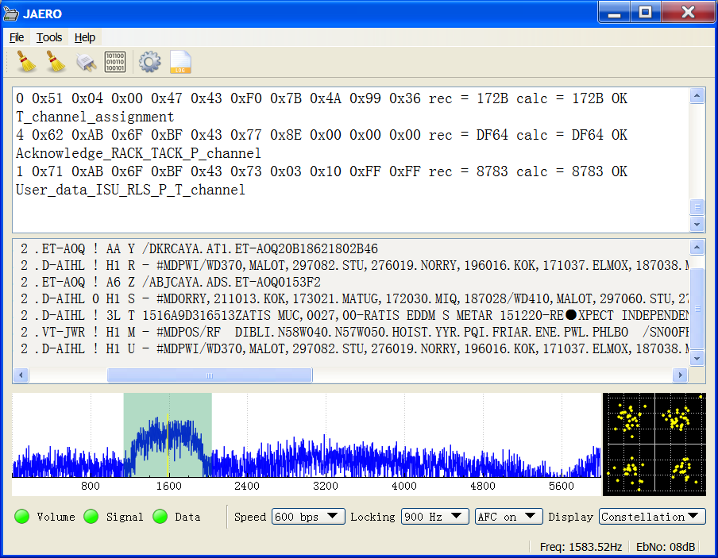
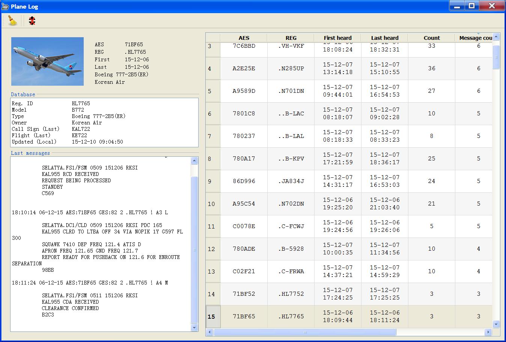

# JAERO
A SatCom ACARS demodulator and decoder for the Aero standard written in C++ Qt

This program demodulates and decodes ACARS messages sent from satellites to Aeroplanes (SatCom ACARS) commonly used when Aeroplanes are beyond VHF range. Demodulation is performed using the soundcard.
Such signals are typically around 1.5Ghz and can be received with simple low gain antennas that can be home brewed in a few hours.

SatCom ACARS signals are basically MSK like so the demodulator was forked from [JMSK]. The demodulator implements a coherent MSK demodulator type as seen at http://jontio.zapto.org/hda1/msk-demodulation2.html.

The demodulator uses the technique that treats the signal similar to [OQPSK] but with sine wave transitions rather than rectangular transitions. The BER (*Bit Error Rate*) versus EbNo (*Energy per bit to Noise power density*) performance in the presence of AWGN (*Additive White Gaussian Noise*) is the same as coherently demodulated differentially encoded [BPSK]. While designed for MSK it will also demodulate [GMSK] and some types of [BSPK]. The signal is supplied via the audio input of the computer’s soundcard.
The software implements differential decoding hence the modulator must use differential encoding. The output of the demodulator can be directed to either a built-in console or to a [UDP] network port.

Jonti 2015
http://jontio.zapto.org

[OQPSK]: https://en.wikipedia.org/wiki/Phase-shift_keying#Offset_QPSK_.28OQPSK.29
[GMSK]: https://en.wikipedia.org/wiki/Minimum-shift_keying#Gaussian_minimum-shift_keying
[BPSK]: https://en.wikipedia.org/wiki/Phase-shift_keying#Binary_phase-shift_keying_.28BPSK.29
[UDP]: https://en.wikipedia.org/wiki/User_Datagram_Protocol
[SSB]: https://en.wikipedia.org/wiki/Single-sideband_modulation
[Arduino]: https://www.arduino.cc/
[Varicode]: https://en.wikipedia.org/wiki/Varicode
[Spectrum Lab]: http://www.qsl.net/dl4yhf/spectra1.html
[JMSK]: https://github.com/jontio/JMSK
